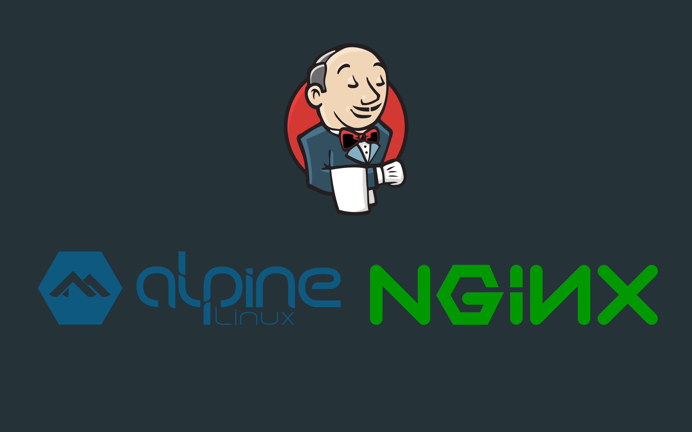
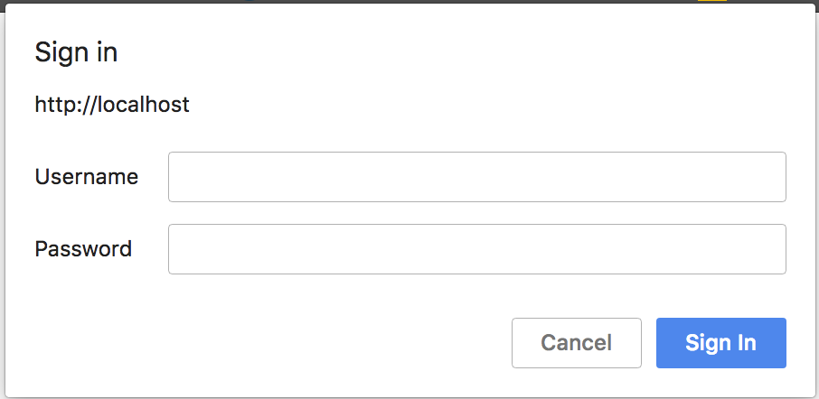

<h1 align="center">JENKINS BEHIND NGINX REVERSE PROXY WITH DOCKER</h1>
<h2 align="center">POWERED BY ORBIS MOBILE TEAM </h2>

<p align="center">
    
</p>

## SUMMARY
This Docker Project uses [nginx][1] and [jenkins][2] docker official images. You will be able to use nginx as a reverse proxy server to access jenkins automation server.

Note: All server configurations in nginx are made to work on a local environment.

## THE FINAL CONTINUOUS INTEGRATION FLOW
If you want to implement the complete [Continuous Integration Flow][3] for your development process, so take a look at our
[Medium Post][3].
<p align="center">
    
</p>

## PREREQUISITIES
1. Install `Docker` and `Docker Compose`.
2. At top level project run `docker-compose up` command from terminal.
3. Go to terminal and run:
```bash
docker ps
```
You will see two running containers as follows:
```bash
CONTAINER ID    IMAGE                          ...        PORTS                 NAMES
621282adb463    jenkinsandroid_nginxservice    ...  0.0.0.0:80->80/tcp    ...jenkinsandroid_nginxservice_1
4dd4d4c68b65    jenkinsandroid_jenkinsservice  ...  8080/tcp, 50000/tcp   ..jenkinsandroid_jenkinsservice_1
```
4. Access to the running nginx container: 
```bash
docker exec -i -t dockernginxjenkinsandroid_nginxservice_1 sh
```
5. Inside the nginx docker container, we must create your own user basic auth
```bash
htpasswd -b -C 5 /etc/apache2/.htpasswd YOUR_USER_NAME YOUR_PASSWORD
```
6. You will be prompted to write a password.
7. That's all, you have a nginx basic auth now.

## LET'S GET STARTED
Go to http://localhost/jenkins and you will be prompted to write you user authentication, write your YOUR_USER_NAME and YOUR_PASSWORD
as we explain above and could access to the jenkins server.

<p align="center">
    
</p>

After enter your right credentials, you will be redirect to the jenkins server.

## CLONING A BITBUCKET REPOSITORY WITH JENKINS
Keep in mind that jenkins container already has the `jenkins user`. So you can clone any repository through this user. For that purpose, we are going to create our SSH keys inside the container:
1. Enter to the jenkins repository:
```bash
docker exec -i -t nginxproject_jenkinsservice_1 bash
```
2. Into the container, place into the JENKINS_HOME path (/var/jenkins_home) and try to clone your own repository with SSH, for instance:
```bash
git clone git@bitbucket.org:orbisunt/YOU_REPO.git
```
3. You will be prompted like this:
```bash
The authenticity of host 'bitbucket.org (...)' can't be established.
RSA key fingerprint is SHA256:...
Are you sure you want to continue connecting (yes/no)? 
```
4. Write `yes` and tap enter, the `.ssh` folder will be created automatically and the bitbucket server host  will be added into the known_hosts file (/var/jenkins_home/.ssh/known_hosts)

5. Until this point, we can't clone our repository with SSH because we haven't created our SSH KEYS(private and public) yet. For that purpose, we need to run:
```bash
ssh-keygen
```
6. Press enter and we'll have our private and public keys, something like this:
```bash
cd /var/jenkins_home/.ssh ; ls
id_rsa	id_rsa.pub  known_hosts
```
## ADDIND PUBLIC KEY TO BITBUCKET REPOSITORY
1. Go to Bitbucket -> bitbucket settings -> SSH Keys.
2. Copy the content of your id_rsa.pub and add it.
```bash
cat /var/jenkins_home/.ssh/id_rsa.pub
```
3. Once your bitbucket repository already has your public key, try to clone your repository with ssh again:
```bash
git clone git@bitbucket.org:orbisunt/YOU_REPO.git
```
4. This time you will be able to clone your repository.
5. Happy coding!!!!

## RUNNING ANDROID UI TESTS
When it comes to Android UI Tests, the best way is to run tests in a separate host machine. For that purpose, to advantage of the speed of emulators in your host machine(MacOSX, Linux, Windows). We are going to create a Jenkins Slave Node.

1. Go to  Manage Jenkins > Manage Nodes.
2. Enter Node Name. For example "android".
3. Select Permanent Agent and press OK.
3. Number of executors. For example 1.
4. Set a Remote FS Root. For example "/Users/carlitosdroid/slave"
5. Launch Method > Launch slave agents via Java Web Start
6. That's all. Press Save and Go back to Nodes.
7. Connect slave to jenkins from terminal  run the following:

```bash
java -jar agent.jar -jnlpUrl http://localhost/jenkins/computer/android/slave-agent.jnlp -secret 636e4c1230031230536a46a3fc8f782fa123ea56477fb3f3226c06fcdcf09dd6 -workDir "/Users/carlitosdroid/slave" -auth YOUR_USER_NAME:YOUR_PASSWORD
```

All the steps above are here: [Step by step guide to set up master and slave machines on Windows][4]

## INSTALLING ADDITIONAL ANDROID SDK LIBRARIES
If you wish, you can download these additional libraries for building your app:
```bash
cd $ANDROID_HOME/tools/bin/ && ./sdkmanager "extras;google;m2repository" "platforms;android-27" \
"extras;m2repository;com;android;support;constraint;constraint-layout-solver;1.0.2" \
"extras;m2repository;com;android;support;constraint;constraint-layout;1.0.2" \
"cmake;3.6.4111459" "ndk-bundle"
```

## COMMON ERRORS WITH FASTLANE
ERROR: Git repository is dirty! Please ensure the repo is in a clean state by committing/stashing/discarding all changes first.
SOLUTION: Add fastlane/report.xml code line to your .gitignore file

## COMMON ERRORS WITH CRASHLYTICS
ERROR: WARN - Crashlytics had a problem uploading the distribution. Project is inactive
SOLUTION: Imeplementing crashlytic correctly in your project and generate a crash to active the app in crashlytics darshboard.

## COMMON ERRORS WHEN WORKING WITH GOOGLE CLOUD
Make the server port is available, usually the default available por is 80


[1]: https://hub.docker.com/_/nginx/
[2]: https://hub.docker.com/r/jenkins/jenkins/
[3]: https://medium.com/p/3bc00a9b99f/edit
[4]: https://wiki.jenkins.io/display/JENKINS/Step+by+step+guide+to+set+up+master+and+slave+machines+on+Windows

